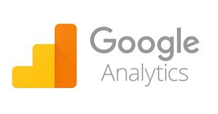

##### Name :
Your Name

##### Date :
24Jan2020

## Questions to answer

Please use graphics to show your work where necessary.

Image display example:

---
Questions-in-blue:

1. What types of information is given in the _Realtime_ tab in Google Analytics?

TODO

2. Can you name four main types of information from this tab that could be used to get to know who your site's visitors are?

TODO

3. In the _Realtime_ tab, explain the definitions and uses of the following items; _Pageviews_, _Top Active Pages_ and _Top Referrals_.

TODO

4. What types of options exist in the Audience tab? Discuss the types of studies that can be made using this information.

TODO

5. What type of information can be found in the _Audience_ -> _UsersFlow_?

TODO

6. Describe what type of information can be found in the _Audience_ -> _Demographics_ menu item. In a hypothetical situation, how could this information be helpful to a business that sells its products online?

TODO

7. In the _Audience_ -> _Behavior_ -> _New vs Returning_ item, there are some plots and statistics available. Explain what this information is and how it could be used in the context of a social website whose goal is get visitors to read an extensive number of blog entries.

TODO

8. Describe how you could use the dashboard to investigate the geographic origins of the users of the web site.

TODO

9. Now that you have spent some time investigating the _Realtime_ and  _audience_ tabs, explain why there cannot be just _one_ (single) plot or _one_ (single) major statistic that could accurately describe all there is to know about the traffic to web page.

TODO

10. __Ethical question__: describe types of major decisions that could be made by only looking at the information available from Google Analytics, which could have unethical implications in terms of humanitarian or environmental interests. Please consider this answer carefully and be creative in the types of decisions which can be made in this informational arena.

TODO

---
(Did you remember to add your name to the top of this document?)
